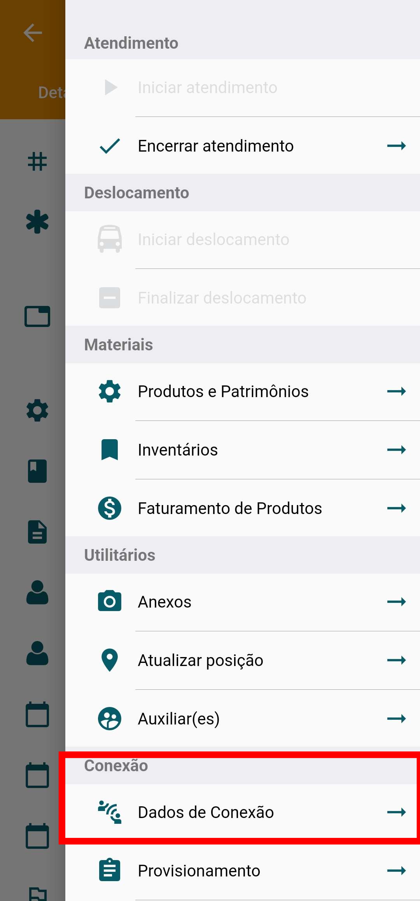
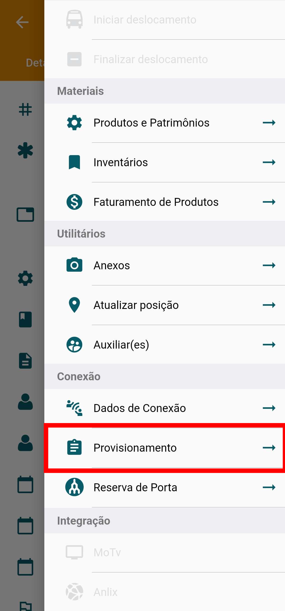
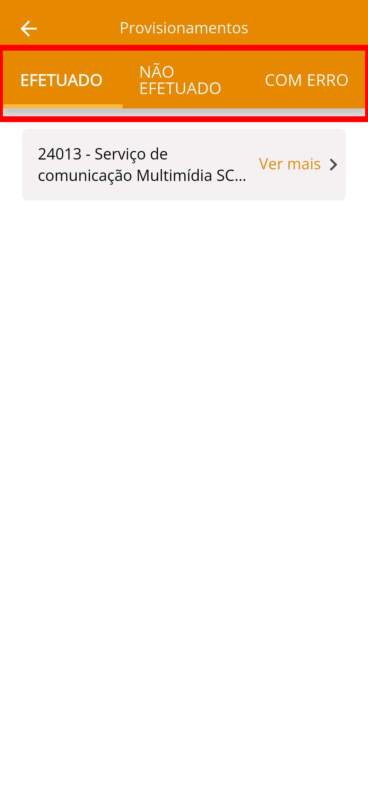
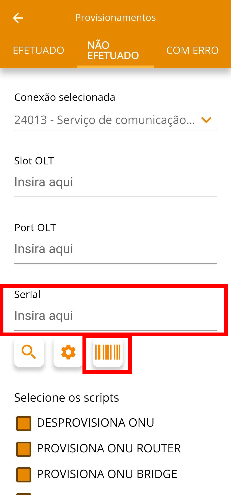

# Manual Técnico — Provisionamento via APP

## Sumário

- [1. Objetivo](#1-objetivo)
- [2. Escopo](#2-escopo)
- [3. Público-alvo](#3-publico-alvo)
- [4. Pré-requisitos](#4-pre-requisitos)
- [5. Convenções do documento](#5-convencoes-do-documento)
- [6. Arquitetura e componentes](#6-arquitetura-e-componentes)
- [7. Inventário / Variáveis](#7-inventario--variaveis)
- [8. Procedimento de provisionamento](#8-procedimento-de-provisionamento)
- [9. Configuração ONU](#9-configuracao-onu)
- [10. Validação e testes](#10-validacao-e-testes)
- [11. Rollback](#11-rollback)
- [12. Monitoramento e manutenção](#13-monitoramento-e-manutencao)
- [13. Segurança](#13-seguranca)
- [14. Troubleshooting](#14-troubleshooting)

---

## 1. Objetivo

- **Ação:** Definir o procedimento padrão para o provisionamento (ativação) e desprovisionamento de ONUs na rede GPON.
- **Ferramenta:** Utilizar o aplicativo móvel **Voalle Tasks** como interface de gestão em campo.
- **Resultado:** Garantir a ativação rápida, padronizada e o registro correto do equipamento no ERP Voalle.

---

## 2. Escopo

- **Início:** Inicia-se com a abertura da Ordem de Serviço (OS) de Instalação no **Voalle Tasks**.
- **Processo:** Abrange o login no app, a leitura/inserção do Serial da ONU e a execução do comando de provisionamento.
- **Fim:** Encerra-se com a **confirmação do registro da ONU** na OLT (luz _Auth/Link_ estável) e a finalização da OS no aplicativo.
- **Exclusão:** Não abrange a configuração da OLT, instalação física da fibra (fusão, medição de sinal), ou _troubleshooting_ de problemas na camada física (ex: LOS).

---

## 3. Público-alvo

- Técnicos de Instalação e Suporte de Campo.
- Supervisores e Coordenadores Técnicos.

---

## 4. Pré-requisitos

- **Ferramentas:** Dispositivo móvel (Android/iOS) com o app **Voalle Tasks** instalado e atualizado.
- **Acesso:** Credenciais de acesso ao Voalle Tasks (usuário com permissão para provisionamento e gestão de OS).
- **Dados:** Número de Série (SN) completo da ONU a ser instalada.
- **Sistema:** Ordem de Serviço (OS) ou Atendimento/Tarefa aberta no Voalle, com a porta PON correta já reservada ou definida.
- **Físico:** ONU conectada à porta PON e recebendo sinal óptico adequado (LED **LOS apagado**).

---

## 5. Convenções do documento

| Convenção   | Significado                                                     | Aplicação                  |
| :---------- | :-------------------------------------------------------------- | :------------------------- |
| **Negrito** | Nomes de menus, botões ou ações no aplicativo **Voalle Tasks**. | Tocar em **Provisionar**.  |
| _Itálico_   | Informações de _input_ ou dados variáveis.                      | Inserir o _Serial Number_. |

---

## 6. Arquitetura e componentes

- **Componente 1:** OLT (Modelo e Firmware específicos).
- **Componente 2:** Servidor/Instância do **Voalle ERP** (onde a lógica de provisionamento reside).
- **Componente 3:** Aplicativo **Voalle Tasks** (interface móvel para o técnico).
- **Componente 4:** ONU do Cliente (Fabricante/Modelo homologado).
- **Interação:** O técnico insere o SN no **Voalle Tasks** $\rightarrow$ o app envia o SN para o **Voalle ERP** $\rightarrow$ o **ERP** envia o comando de autorização (via API ou protocolo) para a **OLT**.

---

## 7. Inventário / Variáveis

| Variável      | Descrição                                         | Exemplo        |
| :------------ | :------------------------------------------------ | :------------- |
| **SN da ONU** | _Serial Number_ único do equipamento.             | `4857544300A1` |
| **ID da OS**  | Código de identificação do atendimento no Voalle. | `256689`       |
| **PORT**      | Identificação da porta PON na OLT.                | `12`           |
| **SLOT**      | Identificação da porta PON na OLT.                | `1`            |

---

## 8. Procedimento de provisionamento

Este procedimento deve ser executado com o técnico já na localização do cliente e com a ONU conectada e com sinal óptico estável (LED LOS apagado).

1.  **Acesso à OS:**
    - Abrir o **Voalle Tasks** e efetuar o login.
    - Localizar a tarefa de instalação/OS **`[ID da OS]`** na lista e tocar nela.
2.  **Iniciar Provisionamento:** - Dentro da OS, localizar e tocar na opção **"Dados da Conexão"**.

    

3.  **Alterar Splitter**

- Rolar a tela até a opção **"Splitter"** e selecionar.
- Vincular a CTO ao cadastro do cliente para alterar o ponto de acesso. **Sem esse vínculo a conexão não subirá.**

    

- _Note que o ponto de acesso irá alterar conforme cadastro de Splitter. Caso o provisionamento falhe pode estar com o Splitter errado._

4. **Provisionamento de ONU**

- Ajustado o ponto de acesso agora é necessário entrar no meu Provisionamento para autenticar a ONU junto a OLT.

    
    

**Ao selecionar a opção será necessário ter em mente que há 3 possibilidades de aparição do serviço:**

- EFETUADO: quando já ocorreu um provisionamento anteriormente. Por exemplo uma troca de equipamento onde já havia uma ONU conectada.
- NÃO EFETUADO: quando nunca ocorreu o provisionamento de uma ONU na conexão. Por exemplo uma ativação.

- COM ERRO: quando ocorreu uma falha no provisionamento. Esse item será abordado no tópico [14. Troubleshooting](#14-troubleshooting).

    
    

5.  **Captura do Serial:**

- **Ler o código de barras** do _Serial Number_ (SN) da ONU usando a câmera do app através do icone de código de barras. - _(Alternativa: Inserir o SN manualmente e conferir a digitação.)_

    
    

6.  **Execução:**

- Clicar no icone de engrenagem para buscar informações da ONU.

  - O sistema deve exibir o SLOT e a Porta PON.
  - Selecionar o script e tocar no botão **"Inicia Provisionamento"**.

    

    

- **ATENÇÃO**: Note que existe um script diferente para **ONT** e **ONU** então selecione o correto

- Aguardar a mensagem de **"ONU Provisionada com Sucesso"**.

---

## 9. Configuração ONU

- ONU provisionada na OLT agora somente será necessário configurar o equipamento da mesma forma que antes porém com dados obtidos do próprio APP.

- Novamente no menu **DADOS DA CONEXÃO** você poderá alterar a senha do PPPoE e vizualizar o usuário, assim como a senha que deverá ser configurada como usuário administrador do equipamento que será única para cada cliente.

    

- Configuração dpara acesso remoto mantém o padrão de liberar apenas para o IP da matriz:

  186.251.166.23/27

  e deve ser feito.

---

## 10. Validação e testes

| Teste                                | Objetivo                                            | Ação em Campo                                                                                          |
| :----------------------------------- | :-------------------------------------------------- | :----------------------------------------------------------------------------------------------------- |
| **Validação Física (Led)**           | Confirmar que a ONU foi autorizada pela OLT.        | Verificar se o LED **AUTH** (ou **LINK/REG**) da ONU está **estável** (fixo, não piscando).            |
| **Validação Lógica (Conectividade)** | Confirmar que o serviço (PPPoE/IPoE) está operante. | Realizar o **Teste de Conexão** no próprio app ou no equipamento do cliente (Ex: Teste de velocidade). |
| **Checagem no APP**                  | Confirmar o status do equipamento no sistema.       | A ONU deve aparecer como **EFETUADO** na interface do provisionamento.                                 |

---

## 11. Rollback

- **Procedimento:** Se o provisionamento falhar, o processo de _rollback_ é o **Desprovisionamento/Deleção** da ONU. Retornar à seção **"Conexão"** da OS no Voalle Tasks (ou na interface web), e usar a opção **"Desprovisionar ONU"** / **"Deletar Equipamento"**.

    

- **Causa:** Recomenda-se tentar o _rollback_ apenas após verificar se a causa da falha **não é física** (LOS).

---

## 12. Monitoramento e manutenção

- **Monitoramento:** O status da ONU (Online/Offline) deve ser monitorado centralmente pela OLT e refletido no painel de gestão do Voalle.
- **Manutenção (Swap):** Em caso de troca de equipamento (_swap_), o técnico deve usar o app para **"Desprovisionar"** a ONU antiga e seguir o **Procedimento de Provisionamento (Seção 8)** para a nova ONU.

---

## 13. Segurança

- Acesso ao Voalle Tasks é restrito por **credenciais individuais**.
- O provisionamento só deve ser realizado em **Ordens de Serviço ativas** e na localização correta.

---

## 14. Troubleshooting

| Sintoma                                              | Causa Mais Comum (Técnico)                                                         | Ação (Técnico)                                                            |
| :--------------------------------------------------- | :--------------------------------------------------------------------------------- | :------------------------------------------------------------------------ |
| **Falha de Provisionamento no App.**                 | _Serial Number_ digitado incorretamente. Ou ainda Splitter incorreto               | **Conferir e digitar/ler novamente o SN. Conferir Splitter correto**      |
| **LED LOS piscando/vermelho.**                       | Problema físico de sinal óptico (Sinal fraco, fibra quebrada).                     | **Verificar emenda/fusão/potência na CTO. Chamar Suporte de Fibra.**      |
| **"Provisionamento OK, mas sem link".**              | Template errado, VLAN incorreta, ou problema no cadastro de serviço (PPPoE).       | **Revisar o Template da ONU e o serviço do cliente no Voalle (ERP Web).** |
| **ONU aparece como "Desautorizada" (Unauthorized).** | Tentativa de provisionamento com SN errado, ou ONU já provisionada em outra porta. | **Desprovisionar e repetir o processo, garantindo o SN correto.**         |
