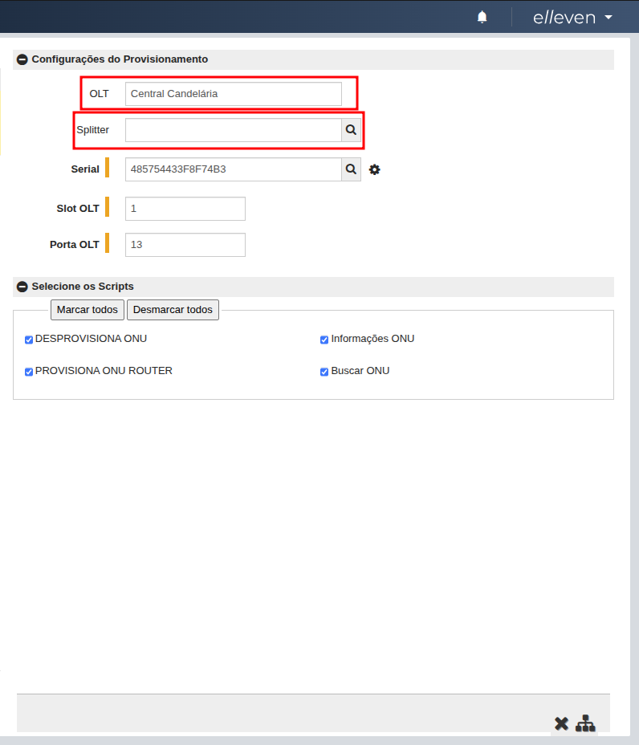
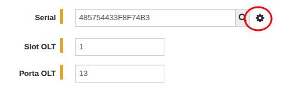
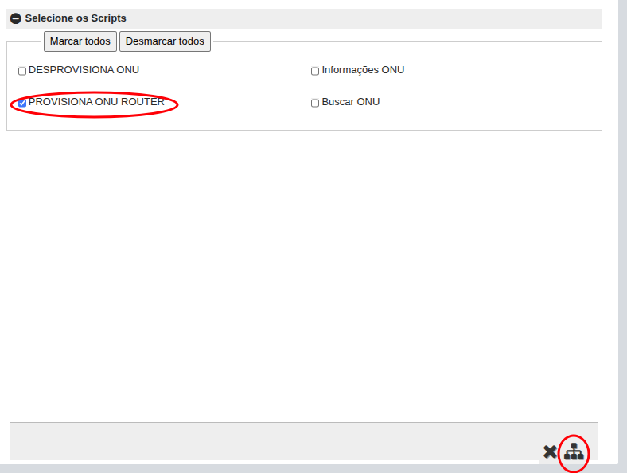

# Provisionamento GPON — Clientes

## Objetivo

Procedimento padrão para provisionamento de Clientes GPON (ONT/ONU) em rede de acesso óptica. Descreve passos desde validação até testes e rollback.

## Escopo

Aplicável a equipes de NOC/Provisionamento para ativação de novos clientes residenciais ou empresariais sobre OLT GPON.

## Glossário

- OLT: Optical Line Terminal
- ONT/ONU: Optical Network Unit / Terminal
- PON: Passive Optical Network
- VLAN: Virtual LAN
- PPPoE/DHCP: métodos de autenticação/atribuição IP

---

## Checklist rápido

1. Remover informações de **ONU** do Voalle (slot/port e ID onu).
2. Conferir **S/N** da ONT e registrar no campo de serial do Voalle.
3. Buscar cliente na rotina Operação/ISP/Dashboard-Manutenção/Provisionamento.
4. Confirmar se o **Ponto de Acesso** está correto
5. Buscar **Slot e Port** clicando no icone de engrenagem.
6. Marcar o script para provisionamento e aplicar.
7. Confirmar o retorno do script e confirmar se há sucesso na operação.
8. Validar com técnico se conexão subiu.
9. Verificar o sinal de **ONU** via **Script**
10. Relatar OS

---

## Passo a passo

### 1. Remover informações de ONU do Voalle (slot/port e ID onu).

    

Remover qualquer ionformação desses 3 campo, eles são extremamente importantes, caso tenha informação errada nesses campos a ONU não vai provisionar!

### 2. Conferir S/N da ONT e registrar no campo de serial do Voalle.

Perguntar para o técnico qual o serial do equipamento e registrar na mesma tela da sessão anterior. Sem o serial corretamente registrado não será possível provisionar.

### 3. Buscar cliente na rotina Operação/ISP/Dashboard-Manutenção/Provisionamento.

    

No campo de pesquisa buscar o cliente por nome, numero do contrato ou ainda PPPoE. Note que ao lado do campo de busca á uma lista cascata que comtem as opções:

- **Provisionada**

  - Quando a ONU já foi provisionada uma vez a conexão aparecerá somente se essa opção estiver selecionada para filtragem. Caso deseje realizar um novo provisionamento deverá selecionar a conexão e clicar no icone de "X" no canto superior, isso irá mover a conexão para a Não Provisionado.

- **Não provisionada**
  - Quando a ONU não foi provisionada ainda a conexão aparecerá nessa opção de filtro. Selecionar a conexão e realizar os processos a seguir para provisiona-la.
- **Erro no provisionamento**
  - A conexão aparecerá aqui quando ocorreu um erro no provisionamento. Ler sempre o retorno do script para entender quan o erro que ocorreu. para voltar ao provisionamento será necessário selecionar a conexão e clicar no icone de "X" no canto superior, isso irá mover a conexão para a Não Provisionado.

### 4. Confirmar se o **Ponto de Acesso** está correto

    

Caso o ponto de acesso não estiver correto, o script será rodado em outra OLT e vai dar erro. O ponto de acesso pode ser alterado atribuindo um Splitter (CTO) a conexão ou ainda na tela de conexão (onde aparece PPPoE e Senha).

**OBS**: _De momento somente está 100% correto a parte de spliters, sendo assim o Splitter pode não aparecer na busca e será necessário acionar administradores do Geogrid (Fernanda, Fernando ou Fauth)_\

### 5. Buscar **Slot e Port** clicando no icone de engrenagem.

    

Com o serial devidamente adicionado, será possível clicar no Icone de Engrenagem e o Slot e Porta da OLT será puxado automaticamente para o ERP, assim como o ID da ONU (esse nao é visivel nessa tela).
Puxando a PON será possível passar para o próximo passo.

### 6. Marcar o script para provisionamento e aplicar.

    

Por padrão todos os scripts vem marcados, desmarcar todas e selecionar somente o necessário. Nesse caso é selecionamos o script de provisionamento de ONU router pois é um V5V2 que o cliente possui, em outros casos aparecerá a opção de ONU Bridge.

### 7. Confirmar o retorno do script e confirmar se há sucesso na operação.

Após a execução do provisionamento, será exibida uma tela de confirmação. Nela será possível verificar se o processo foi concluído com sucesso ou se ocorreu algum erro. Além disso, a tela apresentará o retorno da CLI da OLT, permitindo realizar o troubleshooting caso necessário.

### 8. Validar com técnico se conexão subiu.

Após o provisionamento, confirme com o técnico em campo se a conexão do cliente está ativa e operando corretamente.

### 9. Verificar o sinal de **ONU** via **Script**

Utilize o script disponível para consultar o status e o nível de sinal da ONU, garantindo que os parâmetros ópticos estejam dentro dos padrões aceitáveis.

### 10. Relatar OS

Finalize o processo registrando todas as informações relevantes na Ordem de Serviço, incluindo status do provisionamento, confirmação do técnico e níveis de sinal coletados.
